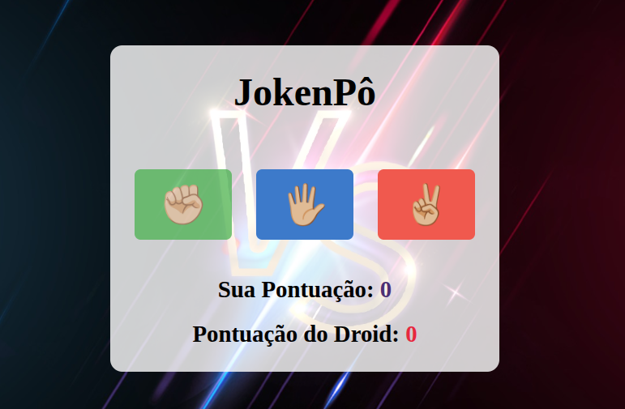

```markdown
# ✊✋✌️ Pedra, Papel e Tesoura  

[]()  
[]()  
[]()  

Um jogo clássico de **Pedra, Papel e Tesoura**, onde você desafia a máquina em rodadas divertidas.  
Projeto simples desenvolvido em **HTML, CSS e JavaScript**.  

---

## 🎮 Demonstração  


[jokenpo5.webm](https://github.com/user-attachments/assets/6df9fa02-f194-4315-92d4-252482059dbf)



👉 ![Demonstração do jogo]

(./assets/jokenpo2.png)
---

## 🚀 Funcionalidades  

- ✅ Jogar contra a máquina  
- ✅ Sistema de pontuação em tempo real  
- ✅ Feedback visual (cores para vitória, derrota e empate)  
- ✅ Interface simples e intuitiva  

---

## 🖥️ Tecnologias Utilizadas  

- **HTML5** 🟠  
- **CSS3** 🔵  
- **JavaScript (ES6)** 🟡  

---

## 📂 Estrutura do Projeto  

```

📦 pedra-papel-tesoura
┣ 📜 index.html      # Estrutura do jogo
┣ 📜 style.css       # Estilos da interface
┣ 📜 script.js       # Lógica do jogo
┗ 📜 README.md       # Documentação

````

---

## ▶️ Como Executar  

1. Clone este repositório:  
   ```bash
   git clone https://github.com/ThAlvesSilva/JokenPo.git
````

2. Acesse a pasta do projeto:

   ```bash
   cd JokenPo
   ```
3. Abra o arquivo `index.html` no navegador.

---

## 🤝 Contribuindo

Contribuições são muito bem-vindas! 💡

1. Faça um **fork** do projeto
2. Crie uma **branch** (`git checkout -b minha-feature`)
3. Faça commit das alterações (`git commit -m 'Minha nova feature'`)
4. Faça o push da branch (`git push origin minha-feature`)
5. Abra um **Pull Request**

---

## 📜 Licença

Este projeto está sob a licença **MIT**.
Sinta-se livre para usar, modificar e compartilhar.

---

✨ Desenvolvido com dedicação por **[ThiagoAlves](https://github.com/ThAlvesSilva)** ✨


